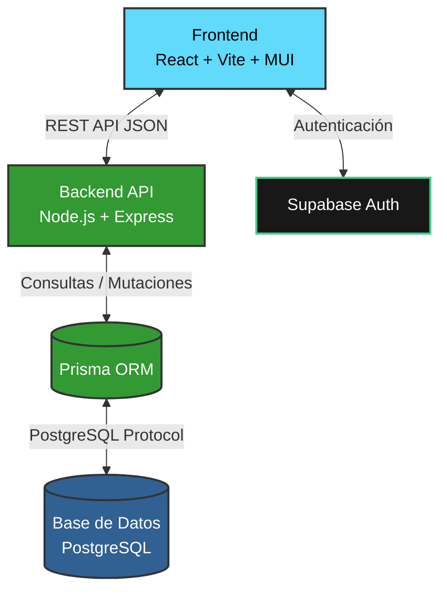
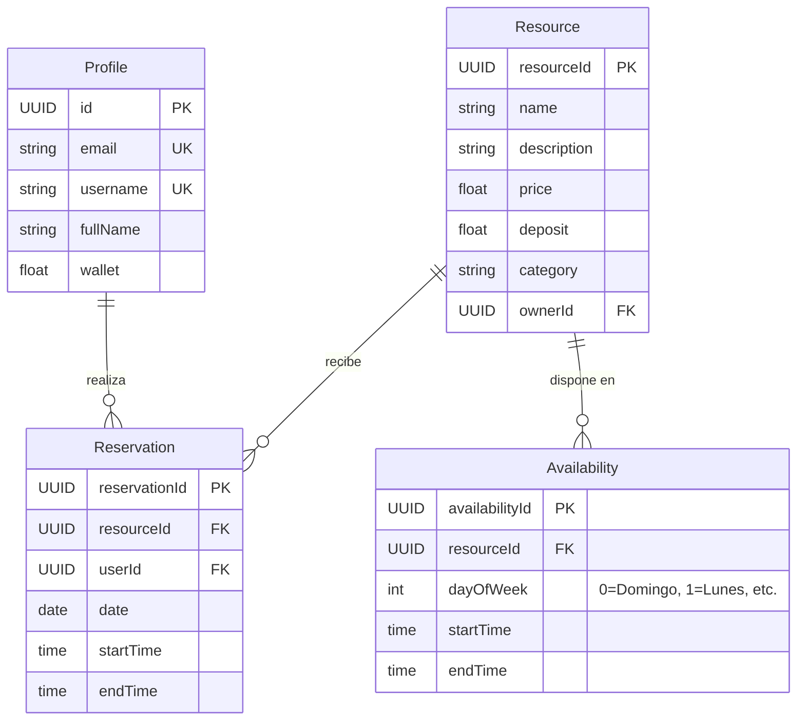

# ShareIt 🚀


ShareIt es una plataforma de gestión integral diseñada para el alquiler, reserva y administración de recursos. Permite a los usuarios consultar disponibilidad, realizar reservas por bloques temporales y gestionar pagos (precio de alquiler y depósitos de seguridad) mediante una billetera (Wallet) digital integrada. A su vez, ofrece a los propietarios poderosas herramientas administrativas como el *Smart Scheduler* para una gestión intuitiva y fragmentación automática de horarios de disponibilidad.

---

## 📑 Tabla de Contenidos

- [✨ Características Principales](#-características-principales)
- [🏗️ Arquitectura del Sistema](#️-arquitectura-del-sistema)
- [🗄️ Esquema de Base de Datos](#️-esquema-de-base-de-datos)
- [🛠️ Stack Tecnológico](#️-stack-tecnológico)
- [🚀 Instrucciones de Ejecución](#-instrucciones-de-ejecución)
  - [1. Backend](#1-backend)
  - [2. Frontend](#2-frontend)
- [📂 Estructura del Proyecto](#-estructura-del-proyecto)

---

## ✨ Características Principales

*   **Reserva Inteligente de Recursos:** Exploración de recursos categorizados, visualización de precios y fianzas con un desglose transparente durante el flujo de reserva.
*   **Billetera Integrada (Wallet):** Flujo de pago simulado que permite a los usuarios recargar saldo de manera dinámica y realizar los pagos correspondientes a las reservas.
*   **Smart Scheduler para Propietarios:** Entorno de administración frontend para que los dueños de los recursos configuren los horarios. Soporta selección masiva, programación preestablecida y fragmentación horaria automática.
*   **Gestión de Disponibilidad en Tiempo Real:** Validación precisa para garantizar la no superposición de reservas y visualización fidedigna del tiempo disponible.
*   **Diseño Interactivo y Fluido:** Arquitectura frontend alimentada por Material UI y Emotion para una experiencia de usuario estelar.

---

## 🏗️ Arquitectura del Sistema

La solución emplea una arquitectura **Cliente-Servidor**. 
El Frontend (React/Vite) interactúa con el Backend (Node/Express) mediante llamadas a una API REST. La autenticación principal se delega a Supabase, mientras que Prisma actúa como ORM, estructurando las consultas a la base de datos PostgreSQL.



---

## 🗄️ Esquema de Base de Datos

La estructura maneja perfiles de usuario, recursos alquilables, las franjas horarias habilitadas (disponibilidad) y las transacciones de reservas finales.



---

## 🛠️ Stack Tecnológico

### Frontend
*   **Framework:** React 19 + TypeScript
*   **Bundler:** Vite
*   **Estilos y Componentes:** Material UI (MUI v7), Emotion
*   **Enrutamiento:** React Router DOM (v7)
*   **Peticiones HTTP:** Axios

### Backend
*   **Entorno de ejecución:** Node.js (v24+)
*   **Framework:** Express.js 5
*   **ORM:** Prisma
*   **Base de Datos y Auth:** Supabase (PostgreSQL)
*   **Documentación de API:** Swagger UI Express
*   **Otros:** Multer (Manejo de archivos), Nodemailer (Correos)

---

## 🚀 Instrucciones de Ejecución

El proyecto corre en dos instancias separadas. Necesitarás **dos terminales** para levantarlo.

### 1. Backend

El backend provee la API principal y se ejecuta sobre el puerto 3000 por defecto. Asegúrate de tener variables de entorno en un fichero `.env` en la carpeta `backend` configuradas con la URL de tu Supabase/Base de Datos.

1. Abre una terminal y colócate en la capreta de backend:
   ```bash
   cd backend
   ```
2. Instala las dependencias:
   ```bash
   npm install
   ```
3. Inicializa Prisma y aplica esquema:
   ```bash
   npx prisma generate
   ```
4. Levanta el servidor (se recomienda `nodemon` en desarrollo):
   ```bash
   npm run dev
   ```

### 2. Frontend

La aplicación web corre mediando Vite de forma local. **Es importante que el Backend ya esté levantado** para evitar errores al recuperar recursos.

1. Abre una nueva terminal y colócate en la carpeta correspondiente:
   ```bash
   cd frontend
   ```
2. Instala las librerías:
   ```bash
   npm install
   ```
3. Ejecuta el servidor de desarrollo:
   ```bash
   npm run dev
   ```
4. Navega a la URL indicada (usualmente `http://localhost:5173/`).

---

## 📂 Estructura del Proyecto

```text
📦 ShareIt
 ┣ 📂 backend/               # Código del servidor API Node/Express
 ┃ ┣ 📂 prisma/              # Esquema de Prisma y gestor base de datos
 ┃ ┣ 📂 src/
 ┃ ┃ ┣ 📂 controllers/       # Lógica principal del negocio (ejs. reservationController)
 ┃ ┃ ┣ 📂 routes/            # Definición de endpoints
 ┃ ┃ ┗ 📂 ...
 ┃ ┣ 📜 package.json
 ┃ ┗ 📜 index.js
 ┣ 📂 frontend/              # Aplicación Web React
 ┃ ┣ 📂 src/
 ┃ ┃ ┣ 📂 components/        # Componentes UI reutilizables
 ┃ ┃ ┣ 📂 pages/             # Vistas de página principales (Dashboard, Wallet, etc.)
 ┃ ┃ ┗ 📂 ...
 ┃ ┣ 📜 package.json
 ┃ ┗ 📜 vite.config.ts
 ┣ 📜 info.md
 ┗ 📜 README.md              # Documentación principal (Este archivo)
```

---
*Construido con dedicación para una gestión de recursos limpia, rápida y productiva.*
